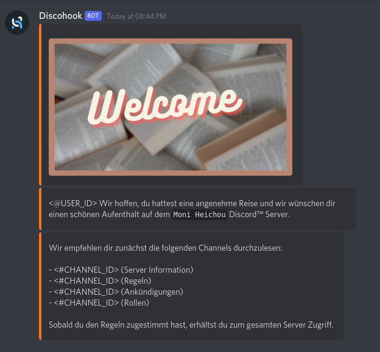

# Auto Messages and Replies

## Table of content

- [Auto Messages and Replies](#auto-messages-and-replies)
  - [Table of content](#table-of-content)
  - [Welcome Message](#welcome-message)

## Welcome Message

Messages send every time some joins the server. 



<details>
<summary>Code</summary>

```json
{
  "content": null,
  "embeds": [
    {
      "color": 16741141,
      "image": {
        "url": "https://i.imgur.com/b32PBsX.png"
      }
    },
    {
      "description": "<@USER_ID> Wir hoffen, du hattest eine angenehme Reise und wir wünschen dir einen schönen Aufenthalt auf dem `Moni Heichou` Discord™ Server.",
      "color": 16741141
    },
    {
      "description": "Wir empfehlen dir zunächst die folgenden Channels durchzulesen: \n\n- <#CHANNEL_ID> (Server Information)\n- <#CHANNEL_ID> (Regeln)\n- <#CHANNEL_ID> (Ankündigungen)\n- <#CHANNEL_ID> (Rollen)\n\nSobald du den Regeln zugestimmt hast, erhältst du zum gesamten Server Zugriff.",
      "color": 16741141
    }
  ],
  "attachments": []
}

```
</details>